# PonderadaS5
Ponderada - Eng Software - M5 - Semana 05

## Go Eat!

### Objetivo

Criar uma aplicação que retorne do banco de dados os restaurantes cadastrados.

### [Vídeo](https://drive.google.com/file/d/1gQWV9T33Bq77ygg_dKQXBDLY4tEIMFjQ/view?usp=sharing)

### Tecnologias

#### AWS: EC2.

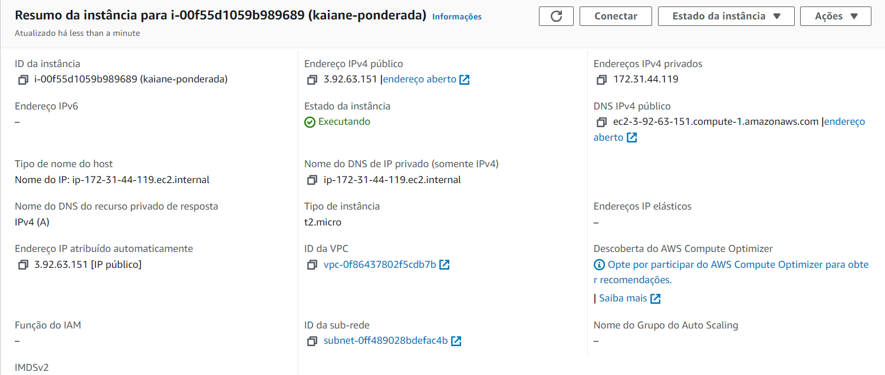

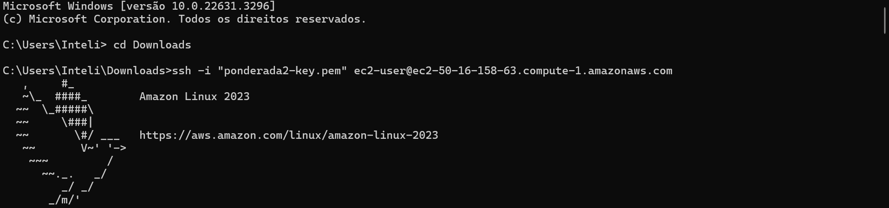

#### AWS: RDS.

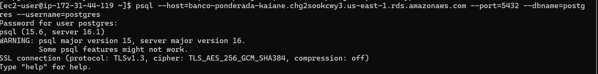

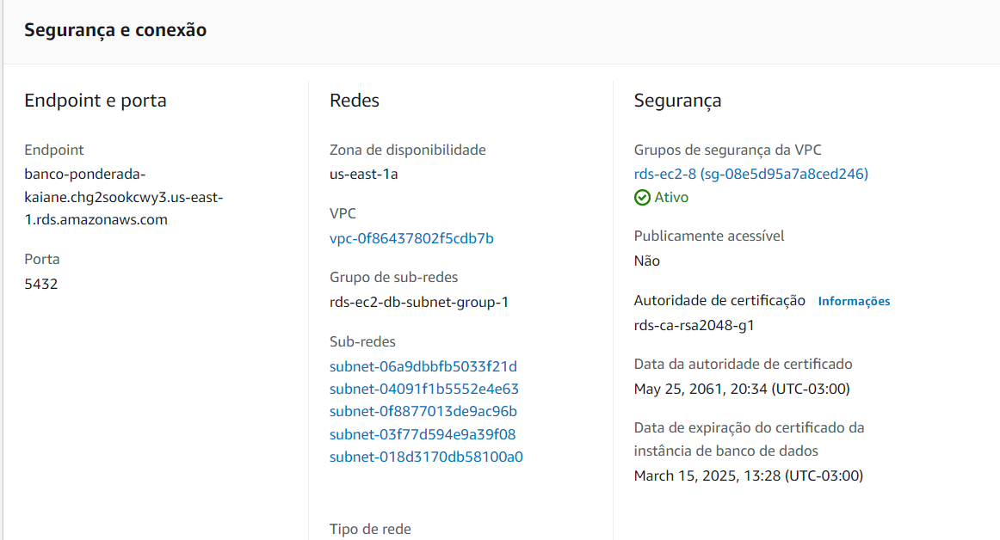

#### Git:

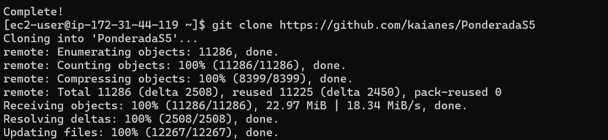

#### FRONTEND: Vite, React.

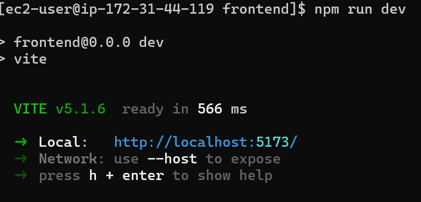

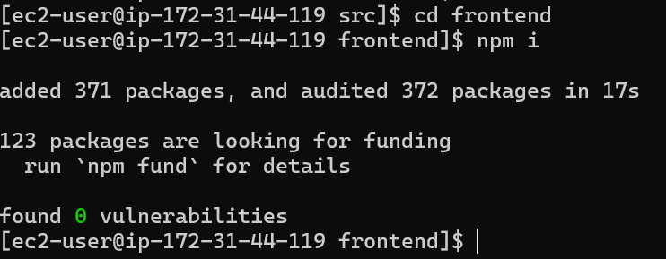

#### BACKEND: Nodejs, express.

(Tentei muito, durante dias, mas não consegui conectar)

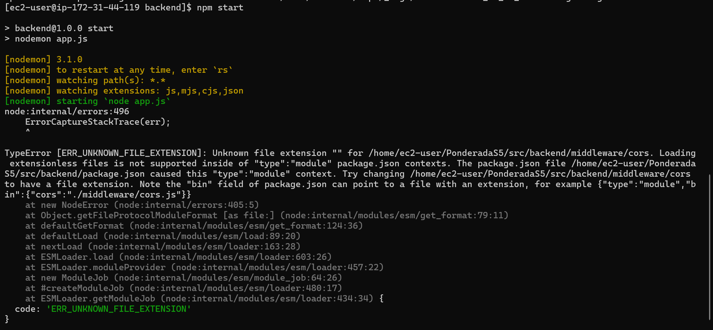

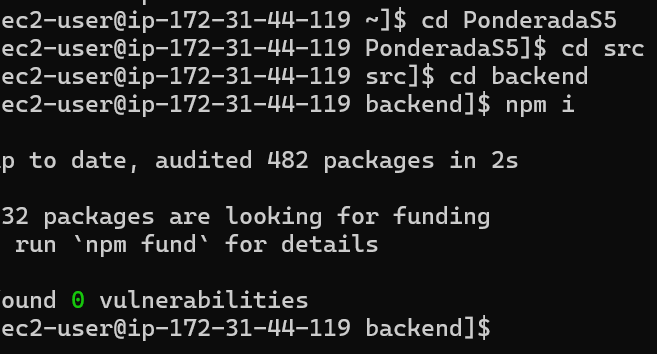

#### BANCO: Postgree.

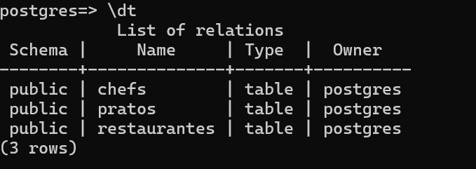

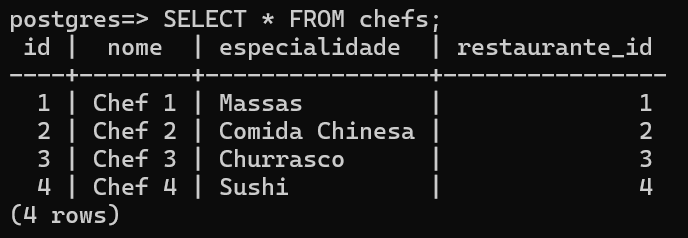

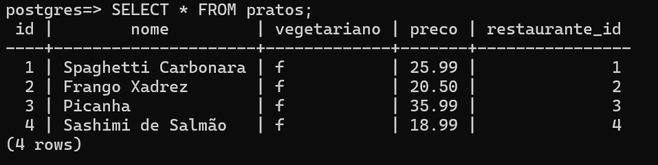

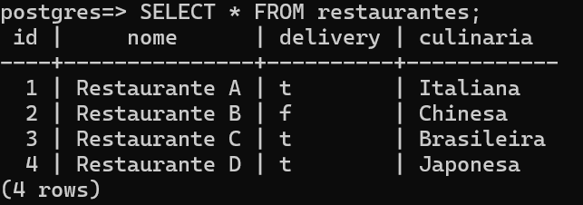
